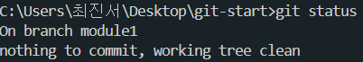

# Git

---

- git init
  - 해당 디렉토리를 git으로 버전관리하겠다.
  - 실제로는 .git 이라는 로컬 저장소를 만들어줌
- git add _test.txt_
  - add + 파일명
  - 해당 파일을 stage에 올리겠다.
- git commit _-m ‘version1’_
  - stage에 올라온 파일을 ‘version1’으로 repository 에 (커밋)저장하겠다.
- git restore _--staged 파일명_
  - 스테이징 → 스테이징 전 (저장 상태)
- git restore _파일명_
  - 스테이징 전 → 최근 커밋한 코드
- git status
  - 상태창
- git log _--all --oneline_
  - commit 기록 보기
- git difftool
  - 바로 이전 커밋과 비교해서 (vim)으로 보여줌
- :q | :qa
  - vim 종료 명령어
  - hjkl로 vim 화면에서 커서 이동가능
- git difftool _id1 id2_
  - id 는 git log _--oneline_ 했을때 나타나는 commit 의 id
  - 두 버전 간의 차이를 보여줌
- git branch module1
  - module1 이라는 이름의 브랜치 생성
  - commit 의 복사와 같음
- git branch module1
  - module1 브랜치로 이동
  - 현재 module1 브랜치에 있음을 확인
  
- HEAD
  - 현재 위치 (main 브랜치에 있)
  
- branch
  - module1 branch 가 잘 완성되어서 main branch 에 합치고 싶을때
    1. git switch main // 메인브랜치로 이동
    2. git merge _합칠브랜치명_
    3. 충돌 : merge 하려는데, 두 브랜치 모두 같은 파일을 수정한 경우
       - 어떤 브랜치의 코드로 변경해야할까?
    4. git merge 명령을 실행하면, 동시 개발한 파일이 두 브랜치의 코드를 종합되어 나타난다. 사용자가 알맞게 수정한 후 merge 하면 된다.
  - merge 명령 시에 탄생하는 브랜치 유형
    1. 3-way merge : 위와 같은 merge 방법
    2. fast-forward : branch 판 시점 부터 main 브랜치의 수정이 아예 없었을때
       - merge 시 팠던 브랜치가 main 브랜치가 된다.
       - git merge _--no --ff_ : fast-forward merge 가 될 상황이지만, 옵션을 추가하면 3-way merge 유형으로 merge 시킬 수 있다.
  - merge 후에도 branch 가 남아있다.
    - 남겨진 branch 는 필요없으므로 삭제한다.
    - git branch _-d 브랜치명_
  - git branch _-D 브랜치명_
    - merge 안한 브랜치를 지울때
  - rebase, squash 는 merge 시 3-way가 될 상황인데, fast-forward 와 동일하게 main branch만 남길 수 있게한다.
  - 잔챙이 브랜치는 rebase, squash 로 없애고,
  - 중요한 브랜치는 3-way merge 로 남기는 것이 좋다.
- git restore _--source 커밋id 파일명_
  1. 여러 파일이 변경되었는데
  2. 해당 파일만 특정 커밋시의 코드로 변경하고싶다.
  3. 특정 커밋id 시점의 파일을 불러와서, 현시점에서 사용할수있다.
- git revert _커밋id_
  - 특정 커밋내용을 삭제하고싶을때
  - 파일선택 안됨
- git revert _커밋1id 커밋2id …_
- git revert _HEAD_
  - 방금 커밋을 삭제
- git reset --_hard 커밋id_
  - 해당 커밋id 가 완료된 시점으로 되돌아
- git reset --_hard HEAD~1_
  - 최근 commit 을 지우고 바로 이전 commit 으로 되돌아감
- git push _-u 원격저장소주소 main_
  - 원격 저장소에 main branch를 push 함
  - _-u_ : 뒤에 따라오는 내용 “_원격저장소주소 main”_ 을 기억한다는 옵션임
    따라서 원격저장소 - 로컬저장소 처음 연결할때만 옵션 넣어주면, git push 까지만 치고 엔터누르면 push 가능함
- git remote add 변수명(ex.origin) 주소
  - 긴 주소를 변수로 관리할수있다.
- 원격저장소에 변동사항이 생기면 push 못한다.(ex.다른 협업자가 push를 먼저 한 상태)
- git pull
  - 원격저장소 → 로컬저장소 로 내용 가져옴
  - 원래는 git pull _원격저장소주소 main_ 인데 git push 할때 -u 로 저장해놨으니 git pull 만 써서 가져옴
  - git pull 은 실제로 git fetch + git merge 임
    - git fetch : 원격저장소에 신규 commit 들을 내 로컬저장소로 가져옴. 가끔 충돌도 일어남
- git clone _원격저장소주소_
  - 원격저장소에 있던 내용을 그대로 복제해옴
- branch 만들기
  - github repository 에서 만들수 있다.
  - 로컬 저장소에서 만들어 원격저장소에 push 할 수 있다.
    1. git branch 브랜치명
    2. git switch 브랜치명
    3. add, commit 수행
    4. git switch main 로 돌아가도 되고 안돌아가도 push 할 수 있음
    5. git push origin module2
       - module2 브랜치를 원격저장소에 push
- merge 하기
  - 로컬에서 module2 브랜치 + main 브랜치를 merge 한 후 push 하는 방법1
  - github 에서 Pull request 하는 방법2
    - Pull request : merge 를 요청하는것
    - base: main ← compare: module2
      - module2 브랜치 + main 브랜치를 merge 한다는 말
    - 협업자가 많을때, Pull request 를 요청하는 것으로 소통이 용이해진다.
- git branch 방법론
  - GitFlow 개발전략 (안정적으로 개발을 진행해야 할때)
    - main 브랜치
    - develope 브랜치 (개발용)
    - feature 브랜치 (develope에 기능추가용)
    
    - hotfix 브랜치 (main 브랜치 버그해결용)
    - 가끔 release 브랜치 (develope 브랜치를 main 브랜치에 합치기 전에 최종 테스트용)
    
  - Trunk-based 개발전략 (이미 안정적인 프로그램일때)
    - main 브랜치와
    - feature 브랜치만 운용
    
- git stash
  - 최근 커밋 이후로 변경된 사항만 따로 stash 라는 임시공간에 저장하는 명령
- git stash list
  - stash에 임시저장한 목록들을 전부 출력
  - staging 안한 파일은 stash에 저장되지 않을 수 있다.
- git stash drop _번호_
  - stash list 를 보면 항목마다 인덱스가 부여되어있다. 그 번호를 가지고 stash 항목 삭제가 가능하다.
- git stash clear
  - stash 항목들 전부 삭제
- git stash save _메모_
  - git stash 인데, 메모와 함께 저장
- git stash pop
  - 임시저장한 목록 중, 최근 것 부터 불러옴
- stash 사용 이유
  - 코드를 stash 하는 대신, 주석처리하면 되지 않을까?
  - 주석은 commit 할 때 반영되므로 stash 를 사용한다.
  - 따라서
    1. 주석 처리 하고
    2. 주석 처리한 코드를 stash에 보관하고
    3. commit 한다.
    - stash 쓰기 싫으면 stash 대신 branch 하나 파서 저장해놓기
